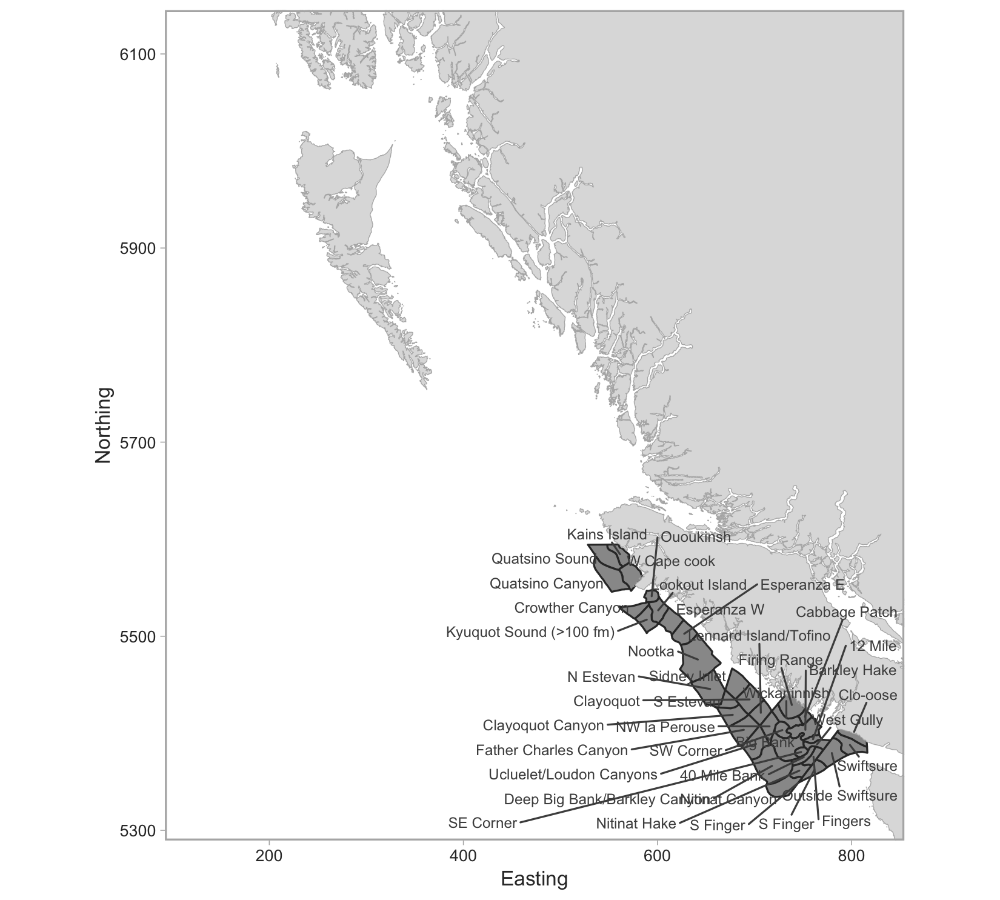

```{r setup, include=FALSE, cache=FALSE}
knitr::opts_chunk$set(echo = FALSE,
                      warning = FALSE,
                      cache = FALSE,
                      autodep = FALSE,
                      cache.comments = FALSE,
                      fig.align = "center",
                      fig.width = 9,
                      dev = 'svg',
                      fig.asp = 0.618)
options(htmltools.dir.version = FALSE)
library(knitr)
```

## 3CD localities



---

## 5ABCD localities


---

class: inverse, middle, center

# A Tweedie GLMM standardization model

---

## Advantages of GLMMs over GLMs for index standardization

GLMMs with random effects for things like vessels, localities, etc.

--

1. allow prediction for an average level

--

1. create more realistic estimates of uncertainty

--

1. make better use of the data

--

1. allow for explicit comparison of variance components

---

## Challenges with *delta* index standardization models

Delta-gamma or delta-lognormal index standardization models:

--

1. add complexity (2 models)

--

1. use 2 GLM links; coefficients cannot be combined

--

1. assume independence among the 2 models

--

1. may be insufficiently robust to variable sampling intensity

--

1. **create an index that is dependent on the reference levels**

---

## The Tweedie distribution


---

## A Tweedie GLMM standardization model

A Tweedie distribution observation model:

$$
  y_i \sim \mathrm{Tweedie}(\mu_i, p, \phi), \quad 1 < p < 2,
$$

--

and a log link (i.e. an exponentiated inverse link):

$$
\begin{align}
 \mu_i &= \exp \left(
  \mathbf{X}_i \mathbf{\beta} + \alpha^\mathrm{locality}_{j[i]} + \alpha^\mathrm{locality-year}_{k[i]} + \alpha^\mathrm{vessel}_{l[i]} \right)
\end{align}
$$

with a vector of predictors $X$, fixed effects $\mathbf{\beta}$, and random intercepts $\alpha$.

---

## Fixed effect coefficients (historical)


---

## Fixed effect coefficients (modern)


---

## Locality random effects (historical)


---

## Locality random effects (modern)


---

## Locality-year random effects (historical)


---

## Locality-year random effects (modern)


---

## CPUE standardizations (historical)


---

## CPUE standardizations (modern)


---

## CPUE standardizations — with and without space-time interactions


---

## Randomized quantile residuals


---

## Locality-specific CPUE trends (**with** space-time interactions)


---

## Locality-specific CPUE trends (**without** space-time interactions)


---

## Simulation testing the space-time assumption


