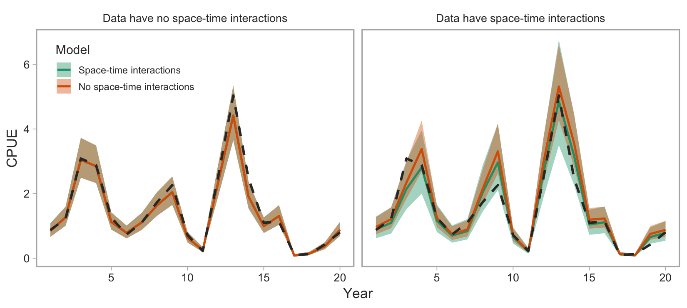

```{r setup, include=FALSE, cache=FALSE, warnings=FALSE, message=FALSE}
knitr::opts_chunk$set(echo = FALSE,
                      warning = FALSE,
                      message = FALSE,
                      cache = TRUE,
                      autodep = TRUE,
                      cache.comments = FALSE,
                      fig.align = "center",
                      fig.width = 9,
                      dev = 'svg',
                      fig.asp = 0.618)
options(htmltools.dir.version = FALSE)
library(knitr)
library(ggplot2)
library(dplyr)
library(gfplot)
```


class: inverse, middle, center

# The goal of commercial CPUE index standardization

---

# Goal

Create an index of Pacific Cod abundance from commercial trawl CPUE that spans from the 1950s to present.

--

Account for the effect of variables that we know have changed through time where possible (e.g. where and when fishing occurs).

---

```{r cpue-params}
params <- list()
params$species_proper <- "Pacific Cod"
params$april1_year <- TRUE
params$area <- c("5[ABCD]+", "3[CD]+")
params$area_name <- c("5ABCD", "3CD")
params$skip_single_variable_models <- FALSE
```

```{r cpue-run-historic, message=FALSE, warning=FALSE, results='hide', include=FALSE}
params$era <- "historic"
source(here::here("R/cpue.R"))
dfleet_hist <- dfleet
gg_cpue_hist <- gg_cpue
cpue_pred_hist <- predictions
arith_cpue_hist <- arith_cpue
m_historic <- readRDS(here::here("data/generated/cpue-models-pcod-historic.rds"))
```

```{r cpue-run-modern, message=FALSE, warning=FALSE, results='hide', include=FALSE}
params$era <- "modern"
source(here::here("R/cpue.R"))
dfleet_modern <- dfleet
gg_cpue_modern <- gg_cpue
cpue_pred_modern <- predictions
arith_cpue_modern <- arith_cpue
m_modern <- readRDS(here::here("data/generated/cpue-models-pcod-modern.rds"))
```

```{r cpue-bubble-functions, include=FALSE}
make_bubble_dat <- function(dat,
  measure.vars = c("month", "locality_code", "vessel", "latitude", "depth")) {
  bubble_pos <- bind_rows(dat) %>%
    filter(spp_catch > 0) %>%
    reshape2::melt(id.vars = c("year", "area"),
      measure.vars = measure.vars) %>%
    group_by(area, year, variable, value) %>%
    summarize(n_pos = n())

  bubble_all <- bind_rows(dat) %>%
    reshape2::melt(id.vars = c("year", "area"),
      measure.vars = measure.vars) %>%
    group_by(area, year, variable, value) %>%
    summarize(n = n())

  left_join(bubble_all, bubble_pos, by = c("area", "year", "variable", "value")) %>%
    ungroup() %>%
    mutate(variable = gfplot:::firstup(gsub("_", " ", variable)))
}

make_facet_bubble_plot <- function(dat, group = "fishing events") {
  ggplot(dat, aes_string("as.factor(year)", y = "value")) +
    geom_point(aes_string(size = "n_pos", fill = "n"), alpha = 0.4, pch = 21) +
    geom_point(aes_string(size = "n"), alpha = 0.4, pch = 21) +
    facet_wrap(~variable, scales = "free", ncol = 2) +
    ggplot2::scale_x_discrete(breaks = seq(1950, 2020, 5)) +
    xlab("") + ylab("") +
    labs(size = paste0("Number of\n", group)) +
    labs(fill = paste0("Number of\n", group)) +
    ggplot2::scale_size_continuous(range = c(0, 7)) +
    ggplot2::scale_fill_viridis_c(trans = "log", breaks = c(1, 10, 100, 500)) +
    theme_pbs() +
    theme(legend.position = c(0.95, 0.05), legend.justification = c(1, 0),
      legend.direction = "horizontal")
}
```

## E.g. depth distribution changes through time

```{r cpue-historical-bubbles-depth}
dfleet_hist %>%
  make_bubble_dat(measure.vars = c("depth")) %>%
  filter(area == "3CD") %>%
  make_facet_bubble_plot(group = "trips") +
  ggtitle("1956-1995 3CD") +
  theme(legend.position = "right")
```

---

## E.g. where fishing occurred changes through time

--

.pull-left[
```{r cpue-locality1, fig.width=7}
gfplot:::plot_dfo_localities(unique(dfleet_modern[[1]]$locality_code))
```
]

--

.pull-right[
```{r cpue-locality2, fig.width=7}
gfplot:::plot_dfo_localities(unique(dfleet_modern[[2]]$locality_code))
```
]

---

## E.g. where fishing occurred changes through time

```{r cpue-historical-bubbles-locality}
dfleet_hist %>%
  make_bubble_dat(measure.vars = c("locality")) %>%
  filter(area == "5ABCD") %>%
  make_facet_bubble_plot(group = "trips") +
  ggtitle("1956-1995 5ABCD") +
  theme(legend.position = "right")
```

---

# Standardization variables 

.pull-left[
### Historical:

- Month
- Locality
- Depth
]

--

.pull-right[
### Modern:

- Month
- Locality
- Depth
- Latitude
- Vessel
]

---

class: inverse, middle, center

# Common approach (at PBS):

## Use an unstandardized ratio or use a delta-lognormal GLM.

---

# We extend the delta-lognormal approach in 3 ways:

--

1. Integrate random effects.

--

2. Use an error distribution that avoids the need for the 'delta' approach.

--

3. Allow for localities to have slightly different trends or time.

---

# Advantages of GLMMs over GLMs for index standardization

GLMMs with random effects for factors like vessels, localities, etc.

--

1. allow prediction for an average level

--

1. create more realistic estimates of uncertainty

--

1. make better use of the data

--

1. allow for explicit comparison of variance components

---

# Challenges with *delta* index standardization models

Delta-gamma or delta-lognormal index standardization models:

--

1. add complexity (2 models)

--

1. use 2 GLM links; coefficients cannot be combined

--

1. assume independence among the 2 models

--

1. may be insufficiently robust to variable sampling intensity

--

1. **create an index that is dependent on the reference levels**

---

class: inverse, middle, center

# A Tweedie GLMM standardization model

---

## The Tweedie distribution


---

## A Tweedie GLMM standardization model

A Tweedie observation model:

$$
  y_i \sim \mathrm{Tweedie}(\mu_i, p, \phi), \quad 1 < p < 2,
$$

--

and a log link:

$$
\begin{align}
 \mu_i &= \exp \left(
  \mathbf{X}_i \mathbf{\beta} + \alpha^\mathrm{locality}_{j[i]} + \alpha^\mathrm{locality-year}_{k[i]} + \alpha^\mathrm{vessel}_{l[i]} \right),
\end{align}
$$

with a vector of predictors $X$, fixed effects $\mathbf{\beta}$, and random intercepts $\alpha$.

Fit with TMB.

---

# Data aggregation

### 'Historical' 

- 1956–1990 (dockside interviews): trip-locality-level data

--

- 1991–1995 (logbooks): fishing-event-level rolled up to trip-locality-level data

--

### 'Modern'

- 1996–2017 (on-board observers/video monitoring): fishing-event-level data

---

# Defining the 'modern' fleet

- ≥ 100 positive Pacific Cod tows across all years

--

- ≥ 5 positive Pacific Cod trips for ≥ 5 years

---

class: inverse, middle, center

# CPUE standardization results

---

## Randomized quantile residuals


---


## Fixed effect coefficients (historical)


---

## Fixed effect coefficients (modern)


---

## Locality random effects (historical)


---

## Locality random effects (modern)


---

## Locality-year random effects (historical)


---

## Locality-year random effects (modern)


---

## CPUE standardizations (historical)


---

## CPUE standardizations (modern)


---

## CPUE standardizations — with and without space-time interactions


---

## Locality-specific CPUE trends (**with** space-time interactions)


---

## Locality-specific CPUE trends (**without** space-time interactions)


---

## Simulation testing the space-time assumption


