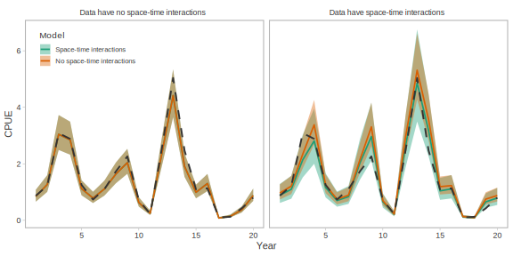

```{r setup, include=FALSE, cache=FALSE, warnings=FALSE, message=FALSE}
knitr::opts_chunk$set(echo = FALSE,
                      warning = FALSE,
                      message = FALSE,
                      cache = TRUE,
                      autodep = TRUE,
                      cache.comments = FALSE,
                      fig.align = "center",
                      fig.width = 8,
                      dev = 'svg',
                      fig.asp = 0.618)
options(htmltools.dir.version = FALSE)
library(knitr)
library(ggplot2)
library(dplyr)
library(gfplot)
theme_set(theme_pbs())
```

class: inverse, middle, center

# The goal of commercial CPUE index standardization...

---

class: middle

<h2 style="color:black">Create an index of Pacific Cod abundance from commercial trawl CPUE that spans from the 1950s to present...</h2>

<h2 style="color:white">while accounting for the effect of variables that we know have changed through time where possible (e.g. where and when fishing occurs).</h2>

---

class: middle

<h2 style="color:grey">Create an index of Pacific Cod abundance from commercial trawl CPUE that spans from the 1950s to present....</h2>

<h2 style="color:black">while accounting, where possible, for the effects of variables that have changed through time (e.g. where and when fishing occurs).</h2>


---

```{r cpue-params}
params <- list()
params$species_proper <- "Pacific Cod"
params$april1_year <- TRUE
params$area <- c("5[ABCD]+", "3[CD]+")
params$area_name <- c("5ABCD", "3CD")
params$skip_single_variable_models <- FALSE
```

```{r cpue-run-historic, message=FALSE, warning=FALSE, results='hide', include=FALSE}
params$era <- "historic"
source(here::here("R/cpue.R"))
dfleet_hist <- dfleet
gg_cpue_hist <- gg_cpue
cpue_pred_hist <- predictions
arith_cpue_hist <- arith_cpue
m_historic <- readRDS(here::here("data/generated/cpue-models-pcod-historic.rds"))
```

```{r cpue-run-modern, message=FALSE, warning=FALSE, results='hide', include=FALSE}
params$era <- "modern"
source(here::here("R/cpue.R"))
dfleet_modern <- dfleet
gg_cpue_modern <- gg_cpue
cpue_pred_modern <- predictions
arith_cpue_modern <- arith_cpue
m_modern <- readRDS(here::here("data/generated/cpue-models-pcod-modern.rds"))
```

```{r cpue-functions, cache=FALSE}
source(here::here('R/cpue-functions.R'))
```

## Depth distribution changes through time

```{r cpue-historical-bubbles-depth}
dfleet_hist %>%
  make_bubble_dat(measure.vars = c("depth")) %>%
  filter(area == "3CD") %>%
  make_facet_bubble_plot(group = "trips") +
  ggtitle("1956-1995 3CD") +
  theme(legend.position = "right")
```

---

## Where fishing occurred changes through time

```{r cpue-locality1, fig.width=9}
g1 <- gfplot:::plot_dfo_localities(unique(dfleet_modern[[1]]$locality_code))
g2 <- gfplot:::plot_dfo_localities(unique(dfleet_modern[[2]]$locality_code))
gridExtra::grid.arrange(g1, g2, ncol = 2)
```

---

## Where fishing occurred changes through time

```{r cpue-historical-bubbles-locality}
dfleet_hist %>%
  make_bubble_dat(measure.vars = c("locality")) %>%
  filter(area == "5ABCD") %>%
  make_facet_bubble_plot(group = "trips") +
  ggtitle("1956-1995 5ABCD") +
  theme(legend.position = "right")
```

---

# Standardization variables

.pull-left[
### Historical:

- Month
- Locality
- Depth
]

--

.pull-right[
### Modern:

- Month
- Locality
- Depth
- Latitude
- Vessel
]

---

class: middle, center

# Common approach (at PBS):

## Use an unstandardized ratio or use a delta-lognormal GLM.

---

# We extend the delta-lognormal approach in 3 ways:

<br>

--

1. Integrate random effects.

--

2. Use an error distribution that avoids the need for the 2-part 'delta' approach.

--

3. Allow for localities to have different trends through time (space-time interactions).

---

# 1. Extending CPUE standardization: integrate random effects

GLMMs with random effects for factors like vessels, localities, etc.

--

* allow prediction for an average level

--

* create more realistic estimates of uncertainty

--

* make better use of the data

--

* allow for explicit comparison of variance components

---

# 2. Extending CPUE standardization: avoiding a 'delta' approach

Delta-gamma or delta-lognormal index standardization models:

--

* add complexity (2 models)

--

* use 2 GLM links; coefficients cannot be combined

--

* assume independence among the 2 models

--

* may be insufficiently robust to variable sampling intensity

--

* **create an index that is dependent on the reference levels**

---

## Delta-lognormal/Gamma models create an index that is dependent on the reference levels


---

# 3. Extending CPUE standardization: allowing for space-time interactions

<br>

## If we don't allow for these then we are implicitly assuming that all localities have had the same trend.

---

class: inverse, middle, center

# A Tweedie GLMM standardization model
# with space-time interactions

---

## The Tweedie distribution

```{r cpue-tweedie-ex, fig.asp=0.61}
plot_tweedie_ex <- function(df, max = 15) {
  xx <- seq(0, max, length.out = 1000)
  out <- plyr::mdply(df, function(mu, power, phi) {
    data.frame(x = xx,
      y = tweedie::dtweedie(y = xx, mu = mu, power = power, phi = phi))
  }) %>%
    mutate(phi = paste("phi =", phi)) %>%
    mutate(power = paste("p =", power)) %>%
    mutate(mu = paste("μ =", mu))

  ggplot(out, aes(x, y, colour = mu)) +
    geom_line() +
    facet_grid(power~phi, scales = "free") +
    gfplot::theme_pbs() +
    labs(colour = "μ") +
    xlab("Value") + ylab("Density") +
    coord_cartesian(expand = FALSE, xlim = c(-0.2, max(out$x))) +
    scale_colour_brewer(palette = "Dark2") +
    scale_fill_brewer(palette = "Dark2")
}

df <- expand.grid(power = c(1.2, 1.6, 1.8), mu = c(1, 3, 6), phi = c(0.5, 1, 2))
plot_tweedie_ex(df)
```

---

## A Tweedie GLMM standardization model

A Tweedie observation model:

$$
  y_i \sim \mathrm{Tweedie}(\mu_i, p, \phi), \quad 1 < p < 2,
$$

--

and a log link:

$$
\begin{align}
 \mu_i &= \exp \left(
  \mathbf{X}_i \mathbf{\beta} + \alpha^\mathrm{locality}_{j[i]} + \alpha^\mathrm{locality-year}_{k[i]} + \alpha^\mathrm{vessel}_{l[i]} \right),
\end{align}
$$

with a vector of predictors $X$, fixed effects $\mathbf{\beta}$, and random intercepts $\alpha$.

Fit with TMB.

---

# Data aggregation

### 'Historical'

- 1956–1990 (dockside interviews): trip-locality-level data

--

- 1991–1995 (logbooks): fishing-event-level rolled up to trip-locality-level data

--

### 'Modern'

- 1996–2017 (on-board observers/video monitoring): fishing-event-level data

---

# Defining the 'modern' fleet

<br>
<br>

- ≥ 100 positive Pacific Cod tows across all years

--

- ≥ 5 positive Pacific Cod trips for ≥ 5 years

---

class: inverse, middle, center

# CPUE standardization results

---

## Randomized quantile residuals

```{r cpue-quantile-residuals, fig.asp=0.61}
qr1 <- qres_tweedie(m_historic[[6]], "cpue")
gqr1 <- plot_qres_histogram(qr1) + ggtitle(paste("Historical", params$area_name[1]))
qr2 <- qres_tweedie(m_historic[[12]], "cpue")
gqr2 <- plot_qres_histogram(qr2) + ggtitle(paste("Historical", params$area_name[2]))
qr3 <- qres_tweedie(m_modern[[8]], "cpue")
gqr3 <- plot_qres_histogram(qr3) + ggtitle(paste("Modern", params$area_name[1]))
qr4 <- qres_tweedie(m_modern[[16]], "cpue")
gqr4 <- plot_qres_histogram(qr4) + ggtitle(paste("Modern", params$area_name[2]))
cowplot::plot_grid(gqr2, gqr1, gqr4, gqr3, ncol = 2)
```

---


## Example fixed effect coefficients (historical)

```{r cpue-fixed-effects-historical, fig.asp=0.61}
toplot <- c(6, 12)
make_fe_plots(m_historic[[toplot[1]]]) + ggtitle(params$area_name[i])
```

---

## Example fixed effect coefficients (modern)

```{r cpue-fixed-effects-modern, fig.asp=0.61}
toplot <- c(8, 16)
make_fe_plots(m_modern[[toplot[1]]]) + ggtitle(params$area_name[i]) +
  facet_wrap(~par_group, scales = "free", nrow = 1)
```

---

## Example locality random effects (historical)

```{r cpue-locality-random-effects, fig.width=4.0, fig.asp=1.3}
toplot <- c(6, 12)
make_re_plots(m_historic[[toplot[1]]], re_names = "locality") +
  ggtitle(params$area_name[i]) + xlab("Random intercept value\n(log space)") +
  theme_pbs(base_size = 9)
```

---

## Example locality-year random effects (modern)

```{r cpue-re-int-ts, fig.asp=0.61}
toplot <- c(8, 16)
make_year_locality_plots(m_modern[[toplot[i]]]) + ggtitle(params$area_name[i])
```

---

### CPUE standardizations (historical)

```{r cpue-index-ts-hist, fig.width=5.5, fig.asp=1.0}
make_cpue_ts_dat(cpue_pred_hist) %>% make_cpue_ts_plot() +
  ggtitle("1956-1995 CPUE") +
  scale_colour_brewer(palette = "Dark2") +
  scale_fill_brewer(palette = "Dark2") +
  theme(strip.text.y = element_text(angle = 0, size = rel(1.5), hjust = 0)) +
  theme(strip.text.x = element_text(angle = 0, size = rel(1.5)))
```

---

### CPUE standardizations (modern)

```{r cpue-index-ts-modern, fig.asp=1.05, fig.width=5.2}
make_cpue_ts_dat(cpue_pred_modern) %>% make_cpue_ts_plot() +
  ggtitle("1996+ CPUE") +
  scale_colour_brewer(palette = "Dark2") +
  scale_fill_brewer(palette = "Dark2") +
  theme(strip.text.y = element_text(angle = 0, size = rel(1.5), hjust = 0)) +
  theme(strip.text.x = element_text(angle = 0, size = rel(1.5)))
```

---

## CPUE standardizations — with and without space-time interactions

```{r cpue-int-test-plot, fig.asp=0.65, fig.width = 8}
g1 <- make_cpue_ts_dat_noint(cpue_pred_hist) %>% make_cpue_ts_plot_noint() +
  ggtitle("1956-1995 CPUE")
g2 <- make_cpue_ts_dat_noint(cpue_pred_modern) %>% make_cpue_ts_plot_noint() +
  ggtitle("1996+ CPUE")
cowplot::plot_grid(g1, g2, ncol = 1)
```

---

## Locality-specific CPUE trends (**with** space-time interactions)


---

## Locality-specific CPUE trends (**without** space-time interactions)


<!--

## Simulation testing the space-time assumption


-->
