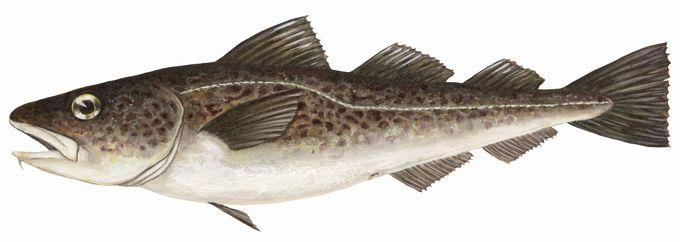
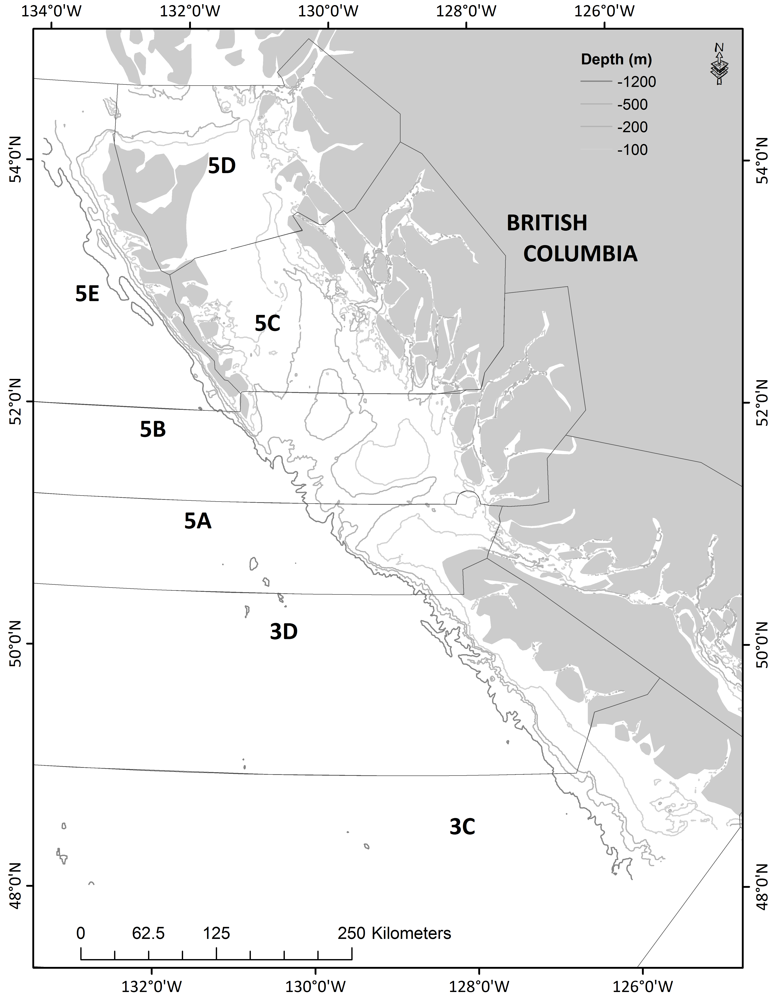
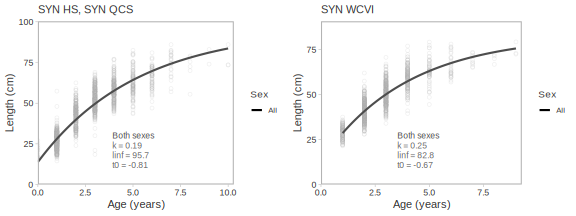
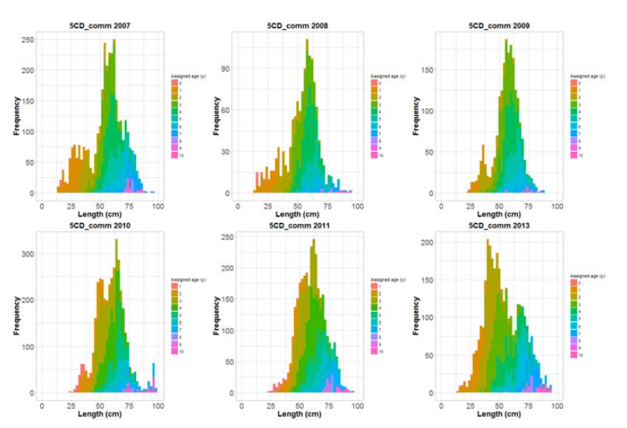
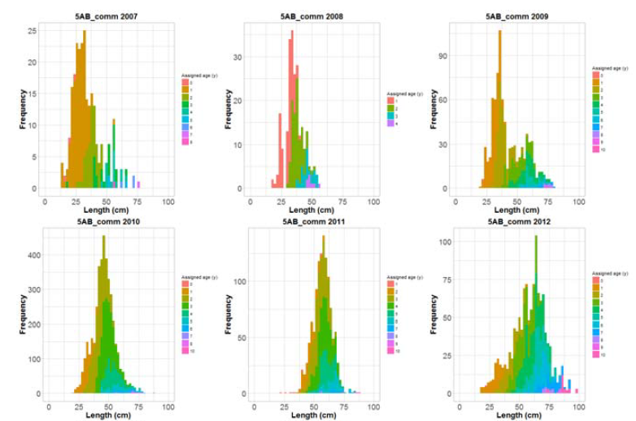
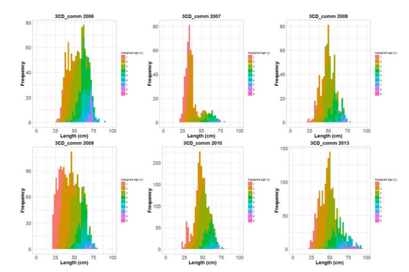

```{r setup, echo = FALSE}
knitr::opts_chunk$set(echo = FALSE,
                      error = FALSE,
                      warning = FALSE,
                      message = FALSE,
                      results = FALSE,
                      cache = TRUE,
                      autodep = TRUE,
                      cache.comments = FALSE,
                      fig.align = "center",
                      fig.width = 8,
                      fig.height = 5,
                      dev = 'svg',
                      fig.asp = 0.618)
options(htmltools.dir.version = FALSE)
```

```{r read-data, include = FALSE}
source(file.path(here::here(), "R", "all.R"))
build(ovwrt.base = FALSE,
      ovwrt.sens = FALSE,
      ovwrt.retro = FALSE,
      burnin = 1000,
      thin = 1)
load.models.into.parent.env()
source(file.path(rootd.R, "custom-knitr-variables.R"))
```

.pull-left[
# Assessment Areas

- Hecate Strait and Queen Charlotte Sound, Areas **5ABCD**

- West Coast Vancouver Island, Areas **3CD**


]

.pull-right[

]

---

# Species overview

- Pacific Cod are distributed from California, through waters of BC, Gulf of Alaska and the Bering Sea to Russia, Korea, Japan and China.

- May be genetically distinct from other areas.

- In BC the maximum age is 10–11 yr and maximum size is 100 cm.

- Pacific Cod are demersal spawners; spawning most likely occurs from February to March.

---

# Commercial Fishery

- Pacific Cod are caught almost entirely by bottom trawl.

- Mainly captured at depths less than 300 m.

- Annual reported catches have shown considerable variability since the beginning of the time series in 1956.

---
class: inverse, middle, center

# Data

---
class: middle

# Data extraction, biological model fitting, and some plotting done with **gfplot**.

<br>

# Groundfish Data Synopsis Report: November 22 and 23.

---

# Commercial Fishery Data

### Summarized by fishing year, April 1 to March 31

### Canadian catches:

- Earliest data from summaries of trawl fishing, 1945. Landings only, recorded by PMFC area (e.g., 5A, 5C) and month.

- GFCatch contains landed catches and some limited discards for 1954-1995.

- PacharvTrawl contains catches and discards for 1996-March 2007. Reliable statistics, largely from at-sea observer logbooks.

- FOS contains catches  and discards for April 2007-present. Reliable statistics, largely from at-sea observer logbooks.

---

# Commercial Fishery Data

### Summarized by fishing year, April 1 to March 31

### USA catches:

- Obtained from PMFC Data Series — combined Canadian and USA landings by PMFC area and month

- USA landings obtained by subtracting the Canadian portion recorded in GFCatch

- Some discrepancies as combined landings were sometimes less than the Canadian amount

- USA catch was then set to zero

---

# Fishery Catch for Area 5ABCD

```{r catch.5abcd}
make.catches.plot(catch.5, every = 5, last.yr = 2018)
```

???

Total catches of Pacific Cod during the period 1956-2017 in Hecate Strait and Queen Charlotte Sound. Catches represent the sum of landings from US and Canadian vessels and estimated at-sea releases from Canadian vessels.

---

# Fishery Catch for Area 3CD

```{r catch.3cd, every = 5, last.yr = 2018}
make.catches.plot(catch.3)
```

???

Total catches of Pacific Cod during the period 1956-2017 off the West Coast of Vancouver Island. Catches represent the sum of landings from US and Canadian vessels and estimated at-sea releases from Canadian vessels.

---

# Research Surveys

### Area 5ABCD

- Queen Charlotte Sound Synoptic Survey 2003-2017

- Hecate Strait Assemblage Survey 1984-2003

- Hecate Strait Pacific Cod Monitoring Survey 2002-2004

- Hecate Strait Synoptic Survey 2005-2017

### Area 3CD

- WCVI Synoptic Survey 2004-2016 (even years, **2018 not included**)

- NMFS Triennial Survey 1989-2001 (1989, 1992, 1995, 1998, 2001)

---

# Survey indices of abundance

- For all surveys, a swept area estimate of biomass in any year y was obtained by summing the product of the CPUE and the area surveyed across the surveyed strata *i*.

- Variance of biomass estimate calculated.

- One thousand bootstrap replicates with replacement constructed to estimate bias corrected 95% confidence levels for each survey year.

---

# Survey indices of abundance for Area 5ABCD - 1
```{r fig-base-index-5abcd-1}
plot_grid(i.plot(base.model.5abcd, base.model.5abcd.name, 1, every = 5, show.fit = FALSE)
            + ylab("HS Assemblage Survey (kg)"),
          i.plot(base.model.5abcd, base.model.5abcd.name, 2, every = 5, show.fit = FALSE)
            + ylab("QCS Synoptic Survey (kg)"),
          i.plot(base.model.5abcd, base.model.5abcd.name, 3, every = 5, show.fit = FALSE)
            + ylab("HS Synoptic Survey (kg)"),
          nrow = 1,
          ncol = 3)
```

---

# Survey indices of abundance for Area 5ABCD - 2
```{r fig-base-index-5abcd-2}
plot_grid(i.plot(base.model.5abcd, base.model.5abcd.name, 4, every = 10, show.fit = FALSE)
            + ylab("Pre-1996 Commercial CPUE (kg/hour)"),
          i.plot(base.model.5abcd, base.model.5abcd.name, 5, every = 5, show.fit = FALSE)
            + ylab("Post-1995 Commercial CPUE (kg/hour)"),
          nrow = 1,
          ncol = 2)
```

---
# Survey indices of abundance for Area 3CD - 1
```{r fig-base-index-3cd-1}
plot_grid(i.plot(base.model.3cd, base.model.3cd.name, 1, every = 5, show.fit = FALSE)
            + ylab("WCVI Synoptic Survey (kg)"),
          i.plot(base.model.3cd, base.model.3cd.name, 2, every = 5, show.fit = FALSE)
            + ylab("Pre-1996 Commercial CPUE (kg/hour)"),
          nrow = 1,
          ncol = 2)
```

---
# Survey indices of abundance for Area 3CD - 2
```{r fig-base-index-3cd-2}
plot_grid(i.plot(base.model.3cd, base.model.3cd.name, 3, every = 5, show.fit = FALSE)
            + ylab("Post-1995 Commercial CPUE (kg/hour)"),
          i.plot(base.model.3cd, base.model.3cd.name, 4, every = 5, show.fit = FALSE)
            + ylab("NMFS Triennial Canada (kg)"),
          nrow = 1,
          ncol = 2)
```

---

# Commercial Length Data

Criteria for length data extraction for use in estimating size composition of bottom trawl catches:

- Commercial trips, bottom trawl only

- By fishing year, April 1 to March 31, based on fishing event haul date/time

- Eliminated 7 samples that may have been tomcod

---

## Commercial Length Data

```{r lengths-comm, fig.asp=1.1, fig.width=5.0}
xx <- dat$commercial_samples %>%
  dplyr::filter(!is.na(length))

xx <- xx[!duplicated(xx$specimen_id), , drop = FALSE]
xx$area <- gfplot::assign_areas(xx$major_stat_area_name,
 area_regex = c("3[CD]+", "5[ABCD]+"))

xx %>%
 filter(!is.na(area)) %>%
 filter(year >= 1996) %>%
  filter(year < 2018) %>%
 filter(species_category_code %in% 1) %>%
 do(gfplot:::bin_lengths(., value = length, bin_size = 2)) %>%
 rename(length_bin = length) %>%
 group_by(year, length_bin, area) %>%
 summarise(n = n()) %>%
 group_by(year, area) %>%
 mutate(proportion = n / sum(n), total = sum(n)) %>%
 ungroup() %>%
 mutate(sex = "M", survey_abbrev = area) %>% # sex = "M" is a trick to plot them all
 plot_lengths() + xlab("Length (cm)") +
 guides(colour = FALSE, fill = FALSE) +
 ggtitle('') +
 theme(strip.text.y = element_text(angle = 0, size = rel(1.0), hjust = 0))
```

---

# Survey Length Data

```{r lengths-surv}
  x <- filter(dat$survey_samples,
              is.element(survey_abbrev, c("SYN HS", "SYN QCS","SYN WCVI")))

 x %>%
  tidy_lengths_raw(survey = c("SYN HS", "SYN QCS", "SYN WCVI"),
  bin_size = 2,
  year_range = c(2002, Inf)) %>%
  plot_lengths()
```

---

# Age data

```{r age-plotages}
tidy_ages_raw(x,
  survey = c("SYN HS", "SYN QCS", "SYN WCVI"),
  ageing_method_codes = 6
) %>%
  plot_ages(
    count_label_size = 3, diagonal_lines = seq(-2100, -1850, 2),
    max_size = 12
  ) +
  scale_x_continuous(breaks = 2006:2011) +
  scale_y_continuous(breaks = seq(1, 10)) +
  ggtitle("") +
  ylim(0, NA)
```

---

# Ageing precision

```{r age-precision}
tidy_age_precision(dat$age_precision, ageing_method_codes = 6) %>%
  plot_age_precision(n = 1e6) +
  scale_x_continuous(breaks = seq(0, 10, 1)) +
  scale_y_continuous(breaks = seq(0, 10, 1)) +
  ggtitle("")
```

---

# von Bertalanffy growth fits



---

# Length-weight fits

```{r age-fit-lw, results='hide', fig.asp=0.4, fig.width=8}
sexes <- c("all")
surveys_list <- list(
  `SYN HS, SYN QCS` = c("SYN HS", "SYN QCS"),
  `SYN WCVI` = "SYN WCVI"
)
lw_fits <-
  map(surveys_list, function(.survey) {
    map(sexes, function(.sex) {
      .dat <- filter(x, is.element(survey_abbrev, .survey))
      fit_length_weight(.dat, .sex, method = "rlm")
    })
  })
lw_figs <- map(lw_fits, ~ plot_length_weight(
  object_all = .x[[1]],
      col = c(All = "grey30"), lab_x_gap = 0.45) +
    ggtitle(paste(unique(.x[[1]]$data$survey_abbrev), collapse = ", ")) +
    guides(colour = FALSE)
  )
cowplot::plot_grid(plotlist = lw_figs, nrow = 1)
```

---

# Probable age-frequency in commercial catch (draft only)

- A simple age-length key was developed, based on age samples from synoptic surveys, 2007 - 2011

- Observed lengths in the commercial fishery were assigned ages, based on probabilities in the age-length key

- This work is draft only, and based on small sample sizes, but does indicate a high proportion of age-2 fish in the commercial fishery

---

# Area 5CD




---

# Area 5AB



---

# Area 3CD




