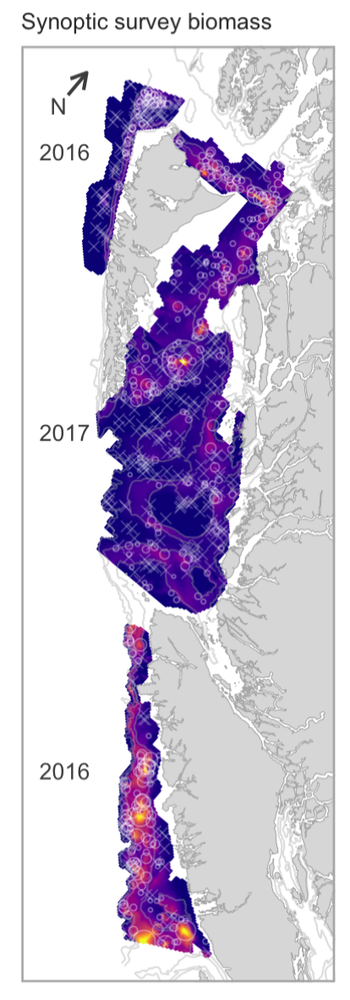

```{r setup, include=FALSE, cache=FALSE, warnings=FALSE, message=FALSE}
knitr::opts_chunk$set(echo = FALSE,
                      warning = FALSE,
                      message = FALSE,
                      cache = FALSE,
                      autodep = FALSE,
                      cache.comments = FALSE,
                      fig.align = "center",
                      fig.width = 7,
                      fig.height = 5,
                      dev = 'svg')
options(htmltools.dir.version = FALSE)
library(knitr)
library(ggplot2)
library(dplyr)
library(gfplot)
theme_set(theme_light())
```


```{r, message=FALSE, warning=FALSE, echo=FALSE}
source(here::here("R/survey-cpue.R"))
```


# QCS Synoptic survey & 5ABCD CPUE

```{r}
compare_indices("SYN QCS", "5ABCD")
```

---

# HS Synoptic survey & 5ABCD CPUE

```{r}
compare_indices("SYN HS", "5ABCD")
```

---

# WCVI survey & 3CD CPUE

```{r}
compare_indices("SYN WCVI", "3CD")
```

---

# Geostatistical survey indices



---

# Geostatistical QCS Synoptic survey & 5ABCD CPUE

```{r}
compare_indices("SYN QCS", "5ABCD", TRUE)
```

---

# Geostatistical HS Synoptic survey & 5ABCD CPUE

```{r}
compare_indices("SYN HS", "5ABCD", TRUE)
```

---

# Geostatistical WCVI survey & 3CD CPUE

```{r}
compare_indices("SYN WCVI", "3CD", TRUE)
```
