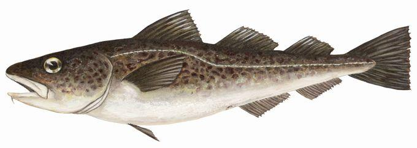

```{r setup, include=FALSE, cache=FALSE}
knitr::opts_chunk$set(echo = FALSE,
                      warning = FALSE,
                      cache = TRUE,
                      autodep = TRUE,
                      cache.comments = FALSE,
                      fig.align = "center",
                      fig.width = 9,
                      dev = 'svg',
                      fig.asp = 0.618)
options(htmltools.dir.version = FALSE)
```

```{r read-data, echo=FALSE, warnings=FALSE, messages=FALSE, results=FALSE}
source(file.path(here::here(), "R", "all.R"))
build(ovwrt.base = FALSE,
      ovwrt.sens = FALSE,
      ovwrt.retro = FALSE,
      burnin = 1000,
      thin = 1)
load.models.into.parent.env()
source(file.path(rootd.R, "custom-knitr-variables.R"))
```

.pull-left[
# Assessment Areas

- Hecate Strait and Queen Charlotte Sound, Areas **5ABCD**

- West Coast Vancouver Island, Areas **3CD**


]

.pull-right[

]

---
# Model characteristics

- Bayesian delay difference model conditioned on catch

--

- Separate assessments for Area 5ABCD and 3CD

--

- Fit to survey indices, commercial CPUE and mean weight data

--

- Stock-recruitment curve constrained to Beverton-Holt function

--

- Fixed variances for observation and process error

---
# The delay difference model

- Collapsed age structured model

--

- Tracks the effects of recruitment, survival and growth on biomass

--

- Performs well, as long as its major assumptions are met:
  - Constant mortality at age
  - Knife-edge selectivity at age
  - Weightage / Weightage-1 is linear (Ford-Walford growth)

---
class: middle, center, inverse
# Area 5ABCD - Base reference model

---
# Area 5ABCD - Priors

```{r fig-base-mcmc-priors-5abcd, fig.width=8, fig.height=5}
make.priors.posts.plot(base.model.5abcd)
```

---
# Area 5ABCD - Fixed parameters

- $\sigma_R$ = 0.8		Standard deviation in log rec. devs

- $\sigma_O$ = 0.25	Overall standard dev in obs. errors

- $\sigma_C$ = 0.05	Standard deviation in log catch devs

- $\sigma_W$ = 0.2		Standard deviation in log mean wt devs


---
# Area 5ABCD - MCMC diagnostics - traces

```{r fig-base-mcmc-trace-5abcd, fig.width=8, fig.height=5}
make.traces.plot(base.model.5abcd)
```

---
# Area 5ABCD - MCMC diagnostics - autocorrelation

```{r fig-base-mcmc-autocor-5abcd, fig.width=8, fig.height=5}
make.autocor.plot(base.model.5abcd)
```

---
# Area 5ABCD - MPD index fits - 1

**(a)** - HS Assemblage, **(b)** - QCS Synoptic, **(c)** - HS Synoptic

```{r fig-base-index-fits-5abcd-1, fig.width=8, fig.height=5}
plot_grid(i.plot(base.model.5abcd, base.model.5abcd.name, 1, every = 5)
            + ylab("Commercial CPUE (kg/hour)"),
          i.plot(base.model.5abcd, base.model.5abcd.name, 2, every = 5)
            + ylab("Commercial CPUE (kg/hour)"),
          i.plot(base.model.5abcd, base.model.5abcd.name, 3, every = 5)
            + ylab("Commercial CPUE (kg/hour)"),
          nrow = 1,
          ncol = 3,
          labels = c("(a)", "(b)", "(c)"),
          label_x = 0.15)
```

---
# Area 5ABCD - MPD index fits - 2

**(d)** - Commercial CPUE pre-1996, **(e)** - Commercial CPUE post-1995

```{r fig-base-index-fits-5abcd-2, fig.width=8, fig.height=5}
plot_grid(i.plot(base.model.5abcd, base.model.5abcd.name, 4, every = 10)
            + ylab("Commercial CPUE (kg/hour)"),
          i.plot(base.model.5abcd, base.model.5abcd.name, 5, every = 5)
            + ylab("Commercial CPUE (kg/hour)"),
          nrow = 1,
          ncol = 2,
          labels = c("(d)", "(e)"),
          label_x = 0.08)
```

---
# Area 5ABCD - Mean weight fits

```{r fig-base-mean-weight-5abcd, fig.width=8, fig.height=5}
mw.plot(base.model.5abcd[[1]], cv = 0.2, every = 5, last.yr = 2015)
```

---
# Area 5ABCD - Catch fits

```{r fig-base-catch-fit-5abcd, fig.width=8, fig.height=5}
catch.fit.plot(base.model.5abcd, every = 5, last.yr = 2015)
```


---
# Area 5ABCD - Biomass


---
# Area 5ABCD - Reference points

**Limit reference point:**
Lowest estimated biomass from which stock recovered to above average ($B_{1971}$)

**Upper Stock Reference**
Average estimated biomass 1956-2004

**Limit Removal Rate**
Average estimated fishing mortality 1956-2004


---
class: middle, center, inverse
# Area 3CD - Base reference model

---
# Area 3CD - Priors

```{r fig-base-mcmc-priors-3cd, fig.width=8, fig.height=5}
make.priors.posts.plot(base.model.3cd)
```

---
# Area 3CD - Fixed parameters

- $\sigma_R$ = 0.8		Standard deviation in log rec. devs

- $\sigma_O$ = 0.25	Overall standard dev in obs. errors

- $\sigma_C$ = 0.05	Standard deviation in log catch devs

- $\sigma_W$ = 0.2		Standard deviation in log mean wt devs


---
# Area 3CD - MCMC diagnostics - traces

```{r fig-base-mcmc-trace-3cd, fig.width=8, fig.height=5}
make.traces.plot(base.model.3cd)
```

---
# Area 3CD - MCMC diagnostics - autocorrelation

```{r fig-base-mcmc-autocor-3cd, fig.width=8, fig.height=5}
make.autocor.plot(base.model.3cd)
```

---
# Area 3CD - MPD index fits - 1

**(a)** - WCVI Synoptic, **(b)** - Commercial CPUE pre-1996

```{r fig-base-index-3cd-1, fig.width=8, fig.height=5}
plot_grid(i.plot(base.model.3cd, base.model.3cd.name, 1, every = 5)
            + ylab("Commercial CPUE (kg/hour)"),
          i.plot(base.model.3cd, base.model.3cd.name, 2, every = 5)
            + ylab("Commercial CPUE (kg/hour)"),
          nrow = 1,
          ncol = 2,
          labels = c("(a)", "(b)"),
          label_x = c(0.17, 0.15, 0.13, 0.23))
```

---
# Area 3CD - MPD index fits - 2

**(c)** - Commercial CPUE post-1995,  **(d)** - NMFS Triennial (Canada)

```{r fig-base-index-3cd-2, fig.width=8, fig.height=5}
plot_grid(i.plot(base.model.3cd, base.model.3cd.name, 3, every = 5)
            + ylab("Commercial CPUE (kg/hour)"),
          i.plot(base.model.3cd, base.model.3cd.name, 4, every = 5)
            + ylab("Commercial CPUE (kg/hour)"),
          nrow = 1,
          ncol = 2,
          labels = c("(c)", "(d)"),
          label_x = c(0.17, 0.15, 0.13, 0.23))
```

---
# Area 3CD - Mean weight fits

```{r fig-base-mean-weight-3cd, fig.width=8, fig.height=5}
mw.plot(base.model.5abcd[[1]], cv = 0.2, every = 5, last.yr = 2015)
```

---
# Area 3CD - Catch fits

```{r fig-base-catch-fit-3cd, fig.width=8, fig.height=5}
catch.fit.plot(base.model.5abcd, every = 5, last.yr = 2015)
```


---
# Area 3CD Biomass
