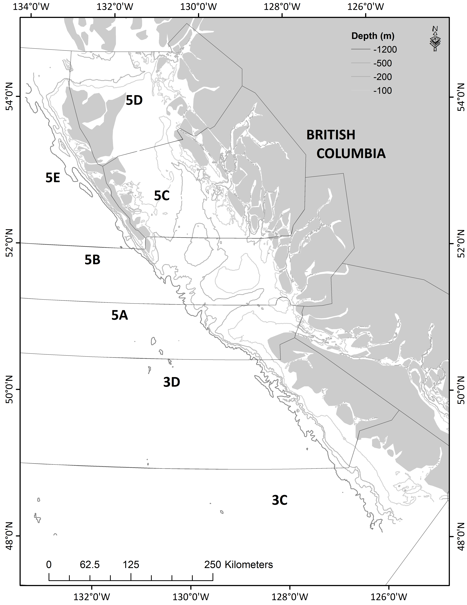

```{r setup, echo = FALSE}
knitr::opts_chunk$set(echo = FALSE,
                      error = FALSE,
                      warning = FALSE,
                      message = FALSE,
                      results = FALSE,
                      cache = TRUE,
                      autodep = TRUE,
                      cache.comments = FALSE,
                      fig.align = "center",
                      fig.width = 8,
                      fig.height = 5,
                      dev = 'svg',
                      fig.asp = 0.618)
options(htmltools.dir.version = FALSE)
```

```{r read-data, include = FALSE, cache=FALSE}
source(file.path(here::here(), "R", "all.R"))
build(ovwrt.base = FALSE,
      ovwrt.sens = FALSE,
      ovwrt.retro = FALSE,
      burnin = 1000,
      thin = 1)
load.models.into.parent.env()
source(file.path(rootd.R, "custom-knitr-variables.R"))
```

.pull-left[
# Assessment Areas

- Hecate Strait and Queen Charlotte Sound, Areas **5ABCD**

- West Coast Vancouver Island, Areas **3CD**


]

.pull-right[

]

---
# Model characteristics

- Bayesian delay difference model conditioned on catch

--

- Separate assessments for Area 5ABCD and 3CD

--

- Fit to survey indices, commercial CPUE and mean weight data

--

- Stock-recruitment curve constrained to Beverton-Holt function

--

- Fixed variances for observation and process error

---
## The delay difference model

- Collapsed age structured model

--

- Tracks the effects of recruitment, survival and growth on biomass

--

- Performs well, as long as its major assumptions are met:
  - Constant mortality at age
  - Knife-edge selectivity at age
  - Weightage / Weightage-1 is linear (Ford-Walford growth)

---
class: middle, center, inverse
# Updates to working paper

---
# Updates to working paper

- In response to reviewer comments, growth parameters were updated to represent males and females combined

- 2018 catch estimate was added to the time series to allow for 2019 projections
  - Two alternative cases for area 3CD

---
# Updated Growth parameters

.pull-left[
**Area 5ABCD**
- Female only:
  - $L_{inf}$ = 98.1
  - $k$ = 0.19
  - $a_0$ = -0.82
- Male and female combined:
  - $L_{inf}$ = 95.51
  - $k$ = 0.19
  - $a_0$ = -0.81
]

.pull-right[
**Area 3CD**
- Female only:
  - $L_{inf}$ = 82.6
  - $k$ = 0.27
  - $a_0$ = -0.55
- Male and female combined:
  - $L_{inf}$ = 82.59
  - $k$ = 0.26
  - $a_0$ = -0.67
]

---
## Area 5ABCD — Biomass plot for difference between the 3 models
```{r fig-sens0-biomass-5abcd}
b.plot(c(base.model.5abcd, sens.models.0), c(base.model.5abcd.name, sens.models.name.0))
```
---
## Area 3CD — Biomass plot for difference between the 3 models
```{r fig-sens0-biomass-3cd}
b.plot(c(base.model.3cd, sens.models.00), c(base.model.3cd.name, sens.models.name.00))
```

---
# Add 2018 catch for Area 5ABCD
- Calculate 3-year average proportion of annual catch taken by Sept. 30

- Apply this proportion to the 2018 catch taken so far to extrapolate to the end of the fishing year

  - Proportion is 0.885

  - 2018 catch as of Sept. 30, 2018 was 203.61 t

  - Extrapolated catch for 2018 season is 230.26 t

---
# Add 2018 catch for Area 3CD
- Two options:
  1. Calculate 3-year average proportion of annual catch taken by Sept. 30

    - Apply this proportion to the 2018 catch taken so far to extrapolate to the end of the fishing year

      - Proportion is 0.563

      - 2018 catch as of Sept. 30, 2018 was 10.58 t

      - Extrapolated catch for 2018 season is 15.29 t

  1. Use the same catch for 2018 as 2017, 164.469 t


---
class: middle, center, inverse
# Area 5ABCD — Base reference model

---
## Area 5ABCD — Priors

```{r fig-base-mcmc-priors-5abcd}
make.priors.posts.plot(base.model.5abcd)
```

---
# Area — MCMC diagnostics - priors/posteriors
```{r fig-base-mcmc-priors-posts-5abcd, fig.width=8, fig.height=5}
make.priors.posts.plot(base.model.5abcd, priors.only = FALSE)
```

---
# Area 5ABCD — Fixed parameters

- $\sigma_R$ = 0.8	Standard deviation in log rec. devs

- $\sigma_O$ = 0.2  Overall standard dev in obs. errors

- $\sigma_C$ = 0.05	Standard deviation in log catch devs

- $\sigma_W$ = 0.2  Standard deviation in log mean wt devs

---
## Area 5ABCD — MCMC diagnostics — traces

```{r fig-base-mcmc-trace-5abcd}
make.traces.plot(base.model.5abcd)
```

---
## Area 5ABCD — MCMC diagnostics — autocorrelation

```{r fig-base-mcmc-autocor-5abcd}
make.autocor.plot(base.model.5abcd)
```

---
## Area 5ABCD — MPD index fits - 1
```{r fig-base-index-fits-5abcd-1}
plot_grid(i.plot(base.model.5abcd, base.model.5abcd.name, 1, every = 5)
            + ylab("HS Assemblage Survey (kg)"),
          i.plot(base.model.5abcd, base.model.5abcd.name, 2, every = 5)
            + ylab("QCS Synoptic Survey (kg)"),
          i.plot(base.model.5abcd, base.model.5abcd.name, 3, every = 5)
            + ylab("HS Synoptic Survey (kg)"),
          nrow = 1,
          ncol = 3)
```

---
## Area 5ABCD — MPD index fits — 2
```{r fig-base-index-fits-5abcd-2}
plot_grid(i.plot(base.model.5abcd, base.model.5abcd.name, 4, every = 10)
            + ylab("Pre-1996 Commercial CPUE (kg/hour)"),
          i.plot(base.model.5abcd, base.model.5abcd.name, 5, every = 5)
            + ylab("Post-1995 Commercial CPUE (kg/hour)"),
          nrow = 1,
          ncol = 2)
```

---
## Area 5ABCD — Mean weight fits

```{r fig-base-mean-weight-5abcd}
mw.plot(base.model.5abcd[[1]], cv = 0.2, every = 5, last.yr = 2015)
```

---
## Area 5ABCD — Reference points

**Limit reference point:**<br />
Lowest estimated biomass from which stock recovered to above average: $B_{1971}$

**Upper Stock Reference:**<br />
Average estimated biomass from 1956-2004

**Limit Removal Rate:**<br />
Average estimated fishing mortality from 1956-2004

---
## Area 5ABCD — Biomass
```{r fig-base-biomass-5abcd}
b.plot(base.model.5abcd,
       base.model.5abcd.name,
       depl = FALSE,
       add.hist.ref = TRUE,
       lrp = c(1971, 1971),
       usr = c(1956, 2004))
```

---
## Area 5ABCD — Recruitment and deviations
```{r fig-base-recr-5abcd}
plot_grid(r.plot(base.model.5abcd,
                 base.model.5abcd.name,
                 add.meds = TRUE,
                 x.axis.angle = 90),
          r.devs.plot(base.model.5abcd,
                      base.model.5abcd.name,
                      x.axis.angle = 90),
          nrow = 1,
          ncol = 2)
```

---
## Area 5ABCD — Fishing mortality
```{r fig-base-f-5abcd}
f.plot(base.model.5abcd,
       base.model.5abcd.name)
```

---
## Area 5ABCD — Retrospective biomass
```{r fig-base-retro-biomass-5abcd}
b.plot.mpd(c(base.model.5abcd, base.retro.models.5abcd),
           c(base.model.5abcd.name, retro.names),
           depl = FALSE)
```

---
class: middle, center, inverse
# Area 3CD — Base reference model

---
## Area 3CD — Priors

```{r fig-base-mcmc-priors-3cd}
make.priors.posts.plot(base.model.3cd)
```

---
# Area 3CD — MCMC diagnostics - priors/posteriors
```{r fig-base-mcmc-priors-posts-3cd}
make.priors.posts.plot(base.model.3cd, priors.only = FALSE)
```

---
# Area 3CD — Fixed parameters

- $\sigma_R$ = 0.8  Standard deviation in log rec. devs

- $\sigma_O$ = 0.2  Overall standard dev in obs. errors

- $\sigma_C$ = 0.05	Standard deviation in log catch devs

- $\sigma_W$ = 0.2  Standard deviation in log mean wt devs


---
## Area 3CD — MCMC diagnostics — traces

```{r fig-base-mcmc-trace-3cd}
make.traces.plot(base.model.3cd)
```

---
## Area 3CD — MCMC diagnostics — autocorrelation

```{r fig-base-mcmc-autocor-3cd}
make.autocor.plot(base.model.3cd)
```

---
## Area 3CD — MPD index fits — 1
```{r fig-base-index-3cd-1}
plot_grid(i.plot(base.model.3cd, base.model.3cd.name, 1, every = 5)
            + ylab("WCVI Synoptic Survey (kg)"),
          i.plot(base.model.3cd, base.model.3cd.name, 2, every = 5)
            + ylab("Pre-1996 Commercial CPUE (kg/hour)"),
          nrow = 1,
          ncol = 2)
```

---
## Area 3CD — MPD index fits — 2
```{r fig-base-index-3cd-2}
plot_grid(i.plot(base.model.3cd, base.model.3cd.name, 3, every = 5)
            + ylab("Post-1995 Commercial CPUE (kg/hour)"),
          i.plot(base.model.3cd, base.model.3cd.name, 4, every = 5)
            + ylab("NMFS Triennial Survey Canada (kg)"),
          nrow = 1,
          ncol = 2)
```

---
## Area 3CD — Mean weight fits

```{r fig-base-mean-weight-3cd}
mw.plot(base.model.5abcd[[1]], cv = 0.2, every = 5, last.yr = 2015)
```

---
# Area 3CD — Reference points

**Limit reference point:**<br />
Lowest estimated biomass from which stock recovered to above average: $B_{1986}$

**Upper Stock Reference:**<br />
Average estimated biomass from 1956-2004

**Limit Removal Rate:**<br />
Average estimated fishing mortality from 1956-2004

---
## Area 3CD — Biomass
```{r fig-base-biomass-3cd}
b.plot(base.model.3cd,
       base.model.3cd.name,
       depl = FALSE,
       add.hist.ref = TRUE,
       lrp = c(1986, 1986),
       usr = c(1956, 2004))
```

---
## Area 3CD — Recruitment and deviations
```{r fig-base-recr-3cd}
plot_grid(r.plot(base.model.3cd,
                 base.model.3cd.name,
                 add.meds = TRUE,
                 x.axis.angle = 90),
          r.devs.plot(base.model.3cd,
                      base.model.3cd.name,
                      x.axis.angle = 90),
          nrow = 1,
          ncol = 2)
```

---
## Area 3CD — Fishing mortality
```{r fig-base-f-3cd}
f.plot(base.model.3cd,
       base.model.3cd.name)
```

---
## Area 3CD — Retrospective biomass
```{r fig-base-retro-biomass-3cd}
b.plot.mpd(c(base.model.3cd, base.retro.models.3cd),
           c(base.model.3cd.name, retro.names),
           depl = FALSE)
```

---
class: middle, center, inverse
# Area 5ABCD — Sensitivity analyses

---
## Area 5ABCD — Biomass for sensitivity to CPUE changes/removals
```{r fig-sens1-biomass-5abcd}
b.plot(c(base.model.5abcd, sens.models.1), c(base.model.5abcd.name, sens.models.name.1))
```

---
## Area 5ABCD — Biomass for sensitivity to CPUE changes/removals
```{r fig-sens1-sub2-biomass-5abcd}
b.plot(c(base.model.5abcd, sens.models.1.sub2), c(base.model.5abcd.name, sens.models.name.1.sub2))
```

---
## Area 5ABCD — Biomass for sensitivity to catchability changes
```{r fig-sens2-biomass-5abcd}
b.plot(c(base.model.5abcd, sens.models.2), c(base.model.5abcd.name, sens.models.name.2))
```

---
## Area 5ABCD — Biomass for sensitivity to natural mortality changes
```{r fig-sens3-biomass-5abcd}
b.plot(c(base.model.5abcd, sens.models.3), c(base.model.5abcd.name, sens.models.name.3))
```

---
## Area 5ABCD — Biomass for sensitivity to the steepness prior
```{r fig-sens4-biomass-5abcd}
b.plot(c(base.model.5abcd, sens.models.4), c(base.model.5abcd.name, sens.models.name.4))
```

---
## Area 5ABCD — Biomass for sensitivity to changes in growth and age at recruitment
```{r fig-sens5-biomass-5abcd}
b.plot(c(base.model.5abcd, sens.models.5), c(base.model.5abcd.name, sens.models.name.5))
```

---
## Area 5ABCD — Fits to mean weights for sensitivity to changes in age at recruitment
```{r fig-sens5-meanweightfit-5abcd}
plot_grid(
  mw.plot(base.model.5abcd[[1]], cv = 0.2, every = 5, last.yr = 2015),
  mw.plot(sens.models.5[[1]], cv = 0.2, every = 5, last.yr = 2015),
          nrow = 1,
          ncol = 2)
```

---
## Area 5ABCD — Biomass for sensitivity to fixed variances
```{r fig-sens6-biomass-5abcd}
b.plot(c(base.model.5abcd, sens.models.6), c(base.model.5abcd.name, sens.models.name.6))
```

---
## Area 5ABCD — Biomass for sensitivity to fixed value of $\sigma_W$
```{r fig-sens7-biomass-5abcd}
b.plot(c(base.model.5abcd, sens.models.7), c(base.model.5abcd.name, sens.models.name.7))
```

---
## Area 5ABCD — Fits to mean weights for sensitivity to fixed value of $\sigma_W$
```{r fig-sens7-meanweightfit-5abcd}
plot_grid(
  mw.plot(sens.models.7[[1]], cv = 0.2, every = 5, last.yr = 2015),
  mw.plot(sens.models.7[[2]], cv = 0.2, every = 5, last.yr = 2015),
          nrow = 1,
          ncol = 2)
```

---
## Area 5ABCD — Biomass for sensitivity to inflating historic biomass
```{r fig-sens8-biomass-5abcd}
b.plot(c(base.model.5abcd, sens.models.108), c(base.model.5abcd.name, sens.models.name.108))
```

---
class: middle, center, inverse
# Area 3CD — Sensitivity analyses

---
## Area 3CD — Biomass for sensitivity to CPUE changes/removals
```{r fig-sens8-biomass-3cd}
b.plot(c(base.model.3cd, sens.models.8), c(base.model.3cd.name, sens.models.name.8))
```

---
## Area 3CD — Biomass for sensitivity to CPUE changes/removals
```{r fig-sens8-sub2-biomass-3cd}
b.plot(c(base.model.3cd, sens.models.8.sub2), c(base.model.3cd.name, sens.models.name.8.sub2))
```

---
## Area 3CD — Biomass for sensitivity to changes in survey priors
```{r fig-sens9-biomass-3cd}
b.plot(c(base.model.3cd, sens.models.9), c(base.model.3cd.name, sens.models.name.9))
```

---
## Area 3CD — Biomass for sensitivity to changes in survey priors
```{r fig-sens9-biomass-3cd-sub}
b.plot(c(base.model.3cd, sens.models.9.sub), c(base.model.3cd.name, sens.models.name.9.sub))
```

---
## Area 3CD — Biomass for sensitivity to changes in natural mortality prior
```{r fig-sens10-biomass-3cd}
b.plot(c(base.model.3cd, sens.models.10), c(base.model.3cd.name, sens.models.name.10))
```

---
## Area 3CD — Biomass for sensitivity to changes in steepness prior
```{r fig-sens11-biomass-3cd}
b.plot(c(base.model.3cd, sens.models.11), c(base.model.3cd.name, sens.models.name.11))
```

---
## Area 3CD — Biomass for sensitivity to changes in growth parameters
```{r fig-sens12-biomass-3cd}
b.plot(c(base.model.3cd, sens.models.12), c(base.model.3cd.name, sens.models.name.12))
```

---
## Area 3CD — Fits to mean weights for sensitivity to changes in growth and age at recruitment
```{r fig-sens12-meanweightfit-3cd}
plot_grid(
  mw.plot(base.model.3cd[[1]], cv = 0.2, every = 5, last.yr = 2015),
  mw.plot(sens.models.12[[1]], cv = 0.2, every = 5, last.yr = 2015),
          nrow = 1,
          ncol = 2)
```

---
## Area 3CD — Biomass for sensitivity to changes in fixed variances
```{r fig-sens13-biomass-3cd}
b.plot(c(base.model.3cd, sens.models.13), c(base.model.3cd.name, sens.models.name.13))
```

---
## Area 3CD — Biomass for sensitivity to fixed value of $\sigma_W$
```{r fig-sens14-biomass-3cd}
b.plot(c(base.model.3cd, sens.models.14), c(base.model.3cd.name, sens.models.name.14))
```

---
## Area 3CD — Fit to mean weights for sensitivity to fixed value of $\sigma_W$
```{r fig-sens14-meanweightfit-3cd}
plot_grid(
  mw.plot(sens.models.14[[1]], cv = 0.2, every = 5, last.yr = 2015),
  mw.plot(sens.models.14[[2]], cv = 0.2, every = 5, last.yr = 2015),
          nrow = 1,
          ncol = 2)
```

---
## Area 3CD — Biomass for sensitivity to inflating historic biomass
```{r fig-sens15-biomass-3cd}
b.plot(c(base.model.3cd, sens.models.15), c(base.model.3cd.name, sens.models.name.15))
```

---
class: middle, center, inverse
# Decision tables

---
## Area 5ABCD — Reference case decision table
<SPAN STYLE="font-size: 6pt">
```{r tab-decision-5abcd, results='asis'}
decision.table(base.model.5abcd,
               base.model.5abcd.name,
               format = "html",
               tac.vec = c(seq(0, 2000, 100), 3000))
```
</SPAN>

---
## Area 5ABCD — Model averaged decision table
<SPAN STYLE="font-size: 6pt">
```{r tab-decision-5abcd-avg, results='asis'}
decision.table(desc.models.5abcd,
               desc.models.5abcd.name,
               format = "html",
               tac.vec = c(seq(0, 2000, 100), 3000))
```
</SPAN>

---
## Area 3CD — Reference case decision table
<SPAN STYLE="font-size: 10pt">
```{r tab-decision-3cd, results='asis'}
decision.table(base.model.3cd,
               base.model.3cd.name,
               format = "html")
```
</SPAN>

---
## Area 3CD — Model averaged decision table
<SPAN STYLE="font-size: 10pt">
```{r tab-decision-3cd-avg, results='asis'}
decision.table(desc.models.3cd,
               desc.models.3cd.name,
               format = "html")
```
</SPAN>
